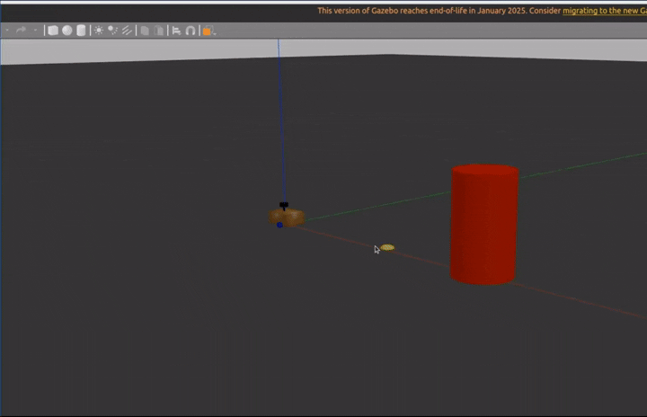

# 差速驱动小车路径规划与控制系统

> ROS 2 Humble | A\* 全局规划 | PI 航向跟踪 | S 曲线速度插值 | Gazebo 仿真



## 项目概述

个人独立完成的差速底盘导航仿真项目，实现 A\* 全局路径规划、PI 航向跟踪与 S 曲线速度插值的完整导航闭环。\
支持自动寻路、预设航点巡迹、键盘手动控制三种模式。

- **控制频率**：20Hz
- **路径规划**：A\* 8 邻域启发式搜索，80×80 栅格地图
- **航向控制**：PI 控制器带积分分离与抗饱和
- **速度平滑**：五次多项式 S 曲线插值，加速时间 0.3 s

***

## 技术栈

**路径规划**：A\* 算法 | 8 邻域搜索 | 障碍物膨胀 | 栅格地图\
**运动控制**：PI 控制器 | 积分分离 | 积分限幅 | 航向跟踪\
**人机交互**：S 曲线插值 | 五次多项式平滑 | 键盘实时控制\
**软件版本**：ROS 2 Humble | Gazebo Classic | Ubuntu 22.04 | Python 3.10+ |\
**工程实现**：Python 3 | rclpy | 自定义导航 | S曲线插值 | PI控制 

***

## 核心亮点

### 1. A\* 全局路径规划

- **完整 A* 算法实现**：支持 8 方向搜索（含对角线移动）
- **自建栅格地图**：80×80 网格，0.2 m 分辨率，覆盖 16 m×16 m 范围
- **自动避障**：基于机器人半径的安全距离计算与障碍物膨胀
- **动态路径规划**：从起点到终点自动计算最优路径，在 Gazebo 仿真中验证绕障能力

### 2. PI 航向跟踪与积分抗饱和

- **积分分离**：大误差时（>0.2 rad）禁用积分，加快响应速度；小误差时启用积分，消除稳态误差
- **积分限幅**：限制积分项在 `[-1.0, 1.0]`，防止积分饱和
- **输出限幅**：PI 控制器输出限制在 `[-0.3, 0.3] rad/s`
- **智能重置**：每个航点开始时清零积分，避免累积误差

### 3. S 曲线速度插值（键盘控制）

- **五次多项式**：`s(t) = 10t³ - 15t⁴ + 6t⁵`，起点和终点加速度为 0，无突变
- **平滑加速**：速度连续变化，消除阶跃感，与导航模式速度参数一致（0.15 m/s, 0.3 rad/s）
- **参数可调**：通过 `accel_time`（默认 0.3 s）调整响应速度

### 4. 多模式导航架构

四种独立启动模式：

```bash
# 模式1: A* 自动寻路（带障碍物场景）
ros2 launch diff_car demo_astar.launch.py

# 模式2: 预设航点巡迹（带障碍物场景）
ros2 launch diff_car demo_simple.launch.py

# 模式3: 键盘手动控制（空场景）
ros2 launch diff_car demo_keyboard.launch.py

# 模式4: 纯仿真环境（无导航）
ros2 launch diff_car launch_sim.launch.py
```

***

## 控制架构

```
┌─────────────────────────────────────────────────────────┐
│ 1. 路径规划层                                            │
│    输入：起点、终点                                      │
│    输出：路径点列表 [(x1,y1), (x2,y2), ...]             │
└────────────────────┬────────────────────────────────────┘
                     ↓
┌─────────────────────────────────────────────────────────┐
│ 2. 航点跟踪层                                            │
│    判断：distance_to_target > 0.15m ?                   │
│    ├─ 是 → 继续跟踪当前航点                              │
│    └─ 否 → 切换到下一个航点                              │
└────────────────────┬────────────────────────────────────┘
                     ↓
┌─────────────────────────────────────────────────────────┐
│ 3. 角度计算层                                            │
│    target_yaw = atan2(target_y - current_y,             │
│                       target_x - current_x)             │
│    yaw_error = target_yaw - current_yaw                   │
│    含义：当前朝向与目标方向的偏差                         │
└────────────────────┬────────────────────────────────────┘
                     ↓
┌─────────────────────────────────────────────────────────┐
│ 4. 决策层（分支控制）                                    │
│    ┌───────────────────────────────────────────────┐   │
│    │ |yaw_error| > 0.5 rad (28.6°)                 │   │
│    │   → 原地旋转（线速度=0，角速度=±0.3 rad/s）    │   │
│    │   → 目的：快速对准目标方向                      │   │
│    │                                               │   │
│    │ |yaw_error| ≤ 0.5 rad                         │   │
│    │   → 前进 + 转向（线速度=0.15，角速度=PI控制）  │   │
│    │   → 目的：边前进边调整方向                      │   │
│    └───────────────────────────────────────────────┘   │
└────────────────────┬────────────────────────────────────┘
                     ↓
┌─────────────────────────────────────────────────────────┐
│ 5. PI 控制层（仅在小误差时生效）                          │
│    输入：yaw_error（角度误差）                            │
│    输出：cmd.angular.z（角速度）                          │
│                                                         │
│    |yaw_error| > 0.2 rad → 仅 P 控制（积分分离）         │
│    |yaw_error| ≤ 0.2 rad → P + I 控制                   │
│    最后：输出限幅到 [-0.3, 0.3] rad/s                   │
└────────────────────┬────────────────────────────────────┘
                     ↓
┌─────────────────────────────────────────────────────────┐
│ 6. 执行层（差速驱动）                                    │
│    发布：Twist() 到 /diff_cont/cmd_vel_unstamped        │
│                                                         │
│    cmd.linear.x  = 0.15 m/s  (前进速度)                 │
│    cmd.angular.z = PI输出  (转向速度)                    │
│                                                         │
│    差速控制器内部计算左右轮速度：                          │
│    左轮 = linear.x - angular.z × wheel_separation/2     │
│    右轮 = linear.x + angular.z × wheel_separation/2     │
└─────────────────────────────────────────────────────────┘
```

## 技术参数

### 运动参数

| 参数    | 值               | 说明           |
| ----- | --------------- | ------------ |
| 线速度   | 0.15 m/s        | 巡迹前进速度       |
| 角速度   | 0.3 rad/s       | 最大旋转速度       |
| 位置容差  | 0.15 m          | 航点到达判定距离     |
| 大角度阈值 | 0.5 rad (28.6°) | 原地旋转与前进转向的分界 |

### A\* 地图参数

| 参数    | 值         | 说明                    |
| ----- | --------- | --------------------- |
| 地图尺寸  | 80×80     | 栅格数量                  |
| 地图分辨率 | 0.2 m     | 每个栅格代表的实际距离           |
| 覆盖范围  | 16 m×16 m | 从 (-4, -4) 到 (12, 12) |
| 机器人半径 | 0.3 m     | 用于计算安全距离              |

### PI 控制器参数

| 参数        | 值               | 说明       |
| --------- | --------------- | -------- |
| 比例增益 (kp) | 2.5             | 角度控制响应速度 |
| 积分增益 (ki) | 0.3             | 稳态误差消除速度 |
| 积分限幅      | ±1.0            | 防止积分饱和   |
| 积分分离阈值    | 0.2 rad (11.5°) | 大误差时禁用积分 |
| 输出限幅      | ±0.3 rad/s      | 最大角速度限制  |

### 键盘控制参数

| 参数    | 值             | 说明         |
| ----- | ------------- | ---------- |
| 最大线速度 | 0.15 m/s      | 与导航模式一致    |
| 最大角速度 | 0.3 rad/s     | 与导航模式一致    |
| 加速时间  | 0.3 s         | S 曲线加速完成时间 |
| 插值公式  | 10t³-15t⁴+6t⁵ | 五次多项式 S 曲线 |

***

## 快速运行

### 编译

```bash
cd ~/bot_ws
colcon build --packages-select diff_car
source install/setup.bash
```

### 1. A\* 自动寻路

```bash
ros2 launch diff_car demo_astar.launch.py
```

**场景说明**：

- 起点：(0, 0)
- 终点：(6, 0)
- 障碍物：(3, 0)，半径 0.3 m
- 行为：机器人自动规划路径，绕过障碍物到达目标点

### 2. 预设航点巡迹

```bash
ros2 launch diff_car demo_simple.launch.py
```

**场景说明**：

- 起点：(0, 0)
- 终点：(6, 0)
- 障碍物：(3, 0)，半径 0.3 m
- 行为：机器人沿预设的 12 个航点巡迹，绕过障碍物到达终点

### 3. 键盘手动控制

```bash
ros2 launch diff_car demo_keyboard.launch.py
```

**按键说明**：

- `i` / `w` - 前进
- `,` / `s` - 后退
- `j` / `a` - 左转
- `l` / `d` - 右转
- `k` - 停止
- `q` - 退出

**控制特性**：

- 采用五次多项式 S 曲线插值，速度平滑变化
- 加速时间 0.3 秒，无速度阶跃
- 速度参数与自动导航模式一致（0.15 m/s, 0.3 rad/s）

## 项目结构

```
diff_car/
├── diff_car/
│   ├── astar_navigator.py          # A* 寻路导航节点
│   ├── demo_simple_navigator.py    # 航点巡迹节点
│   ├── keyboard_control.py         # 键盘控制节点
│   └── __init__.py
├── launch/
│   ├── demo_astar.launch.py        # A* 寻路启动文件
│   ├── demo_simple.launch.py       # 航点巡迹启动文件
│   ├── demo_keyboard.launch.py     # 键盘控制启动文件
│   ├── launch_sim.launch.py        # 基础仿真启动文件
│   └── rsp.launch.py               # 机器人状态发布器
├── config/
│   ├── my_controllers.yaml         # 差速控制器配置
│   ├── gazebo_params.yaml          # Gazebo 参数
│   └── gaz_ros2_ctl_use_sim.yaml   # 仿真时间配置
├── description/
│   ├── robot.urdf.xacro            # 机器人 URDF
│   ├── robot_core.xacro            # 机器人核心结构
│   ├── ros2_control.xacro          # ros2_control 配置
│   ├── lidar.xacro                 # 激光雷达
│   ├── gazebo_control.xacro        # Gazebo 控制
│   └── inertial_macros.xacro       # 惯性宏
├── worlds/
│   ├── demo_obstacle.world         # 障碍物场景
│   └── empty.world                 # 空场景
├── docs/
│   └── NOTES.md                    # 开发笔记与已知问题记录
├── CMakeLists.txt
├── package.xml
└── README.md
```

***

## 开发调试笔记

> 详细记录见 [docs/NOTES.md](docs/NOTES.md)

### 已知问题与改进方向

| 问题     | 说明                                        | 改进方向                                   |
| ------ | ----------------------------------------- | -------------------------------------- |
| 插值时间固定 | 0.3 s 对小速度变化（如 0.05→0）也走完整 S 曲线，可能显得"迟钝"  | 动态插值时间：根据速度差 \|Δv\| 自适应调整 `accel_time` |
| 无紧急制动  | 按 `k` 停止也是 0.3 s 减速，不是立即归零                | 单独增加"急停"逻辑，绕过 S 曲线直接归零                 |
| 键盘无并发  | 不支持同时按 `w` 和 `a`（对角前进），因为 `read(1)` 只读单字符 | 改用 `select` + 多键位状态机                   |
| 循环频率不稳 | `spin_once` + `select` 的组合实际周期可能有抖动       | 引入定时器锁相，或改用 `MultiThreadedExecutor`    |

## 作者

**杨国桂**\
📧 邮箱：puplc\@outlook.com\
📝 CSDN：<https://blog.csdn.net/weixin_51365313>\
💻 GitHub：<https://github.com/7type/diff_car>

***


